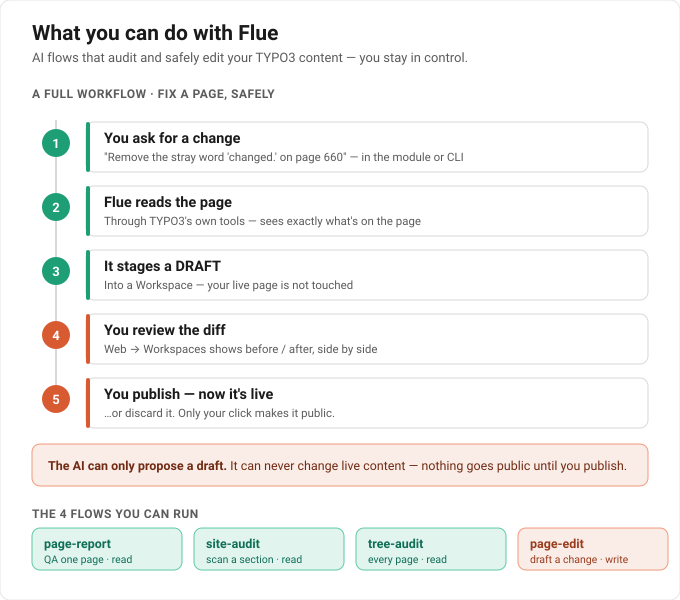

# What you can do with Flue

Flue lets TYPO3 run small **AI jobs ("flows")** on your content. Three of them
*review* content (read-only); one *carefully edits* it (write). You trigger a flow
from the **Web → Flue** backend module or the command line, and the result comes
back into TYPO3 — a structured report, or a draft change waiting for your approval.



## The four flows

| Flow | What it does | Touches |
|---|---|---|
| **page-report** | QA-reviews **one** page → a verdict (`READY` / `NEEDS_WORK` / `BLOCKER`) + a findings table | reads only |
| **site-audit** | Scans a page **subtree** for content-quality + SEO issues (missing meta descriptions, alt-text, …) | reads only |
| **tree-audit** | Audits **every page** under a section (one verdict per page) and rolls them up | reads only |
| **page-edit** | Makes **one requested change**, staged as a **draft** in a Workspace for you to review and publish | writes (draft) |

## Why it's useful

- **Catches what people miss, at scale.** The audits surface real problems across a
  whole section — leftover placeholders (`"first header."`), stray edit artefacts
  (`"changed."` mid-sentence), missing meta descriptions on every page, images with no
  alt-text, even forgotten test pages.
- **Verdicts, not vibes.** Every page gets a clear `READY / NEEDS_WORK / BLOCKER` plus
  a findings table with concrete fixes — not a wall of prose. Each run is stored in
  `tx_flue_run` with its verdict and even the token cost, so it's auditable.
- **AI edits without the risk.** The editor agent **physically cannot touch live
  content** — it can only stage a draft in a TYPO3 Workspace. Your live pages are safe
  even if the AI misunderstands. Nothing goes public until *you* publish.
- **It lives in TYPO3.** Flows use your real pages, your editorial **skills**
  (content-QA, SEO, tone-of-voice), your workspaces and permissions — driven from the
  backend module or the CLI.

## What you need

Most of this is one-time setup (see [Setup.md](Setup.md) for the details):

| | |
|---|---|
| **DDEV running** | the Flue sidecar (`flue` service) starts with the project |
| **An LLM API key in nr-vault** | stored once as `flue_anthropic_api_key`, injected per request |
| **The flows** | `tx_flue_flow` records (page-report, site-audit, tree-audit, page-edit) |
| **For writes: a sandboxed agent user** | a backend user with TSconfig `options.mcpServer.strictSandbox = 1`, set as the `agentBackendUser` extension setting — this is what forces writes to be draft-only |

## The full workflow — fixing a page, safely

The diagram above shows the five steps. In practice:

```bash
# 1) QA the Camino homepage → verdict + findings
ddev exec vendor/bin/typo3 flue:run 1 99 --beuser=1

# 2) Audit the WHOLE Camino section (every page, one verdict each)
ddev exec vendor/bin/typo3 flue:run 3 99 --beuser=1

# 3) Ask the AI to fix something — it stages a DRAFT, never live
ddev exec vendor/bin/typo3 flue:run 4 99 --beuser=1 \
  --instructions="Write a meta description for SEO"
```

Then open **Web → Workspaces** → you'll see the AI's draft (before / after) →
**Publish** to make it live, or **Discard**.

> `flow#` → `1` page-report · `2` site-audit · `3` tree-audit · `4` page-edit (your
> uids may differ — see the **Web → Flue** module). `--beuser` is just *who triggers*;
> the agent itself always acts as the sandboxed agent user, so its writes stay
> draft-only.

## How it works under the hood

When you trigger a flow, the `webconsulting/flue` **control plane** resolves the page
context, reads the LLM key from nr-vault, mints a TYPO3 MCP token for the agent user,
and POSTs to the real **Flue runtime sidecar** (Node). The agent reads — and, for the
page-edit flow, drafts edits into — your TYPO3 content through the
`typo3-mcp-server` MCP tools, and the durable run is mirrored back into `tx_flue_run`.

For the full design and the build roadmap, see
[Concept.md](Concept.md) and [Roadmap.md](Roadmap.md). For installation and the
write-flow safety setup, see [Setup.md](Setup.md).
